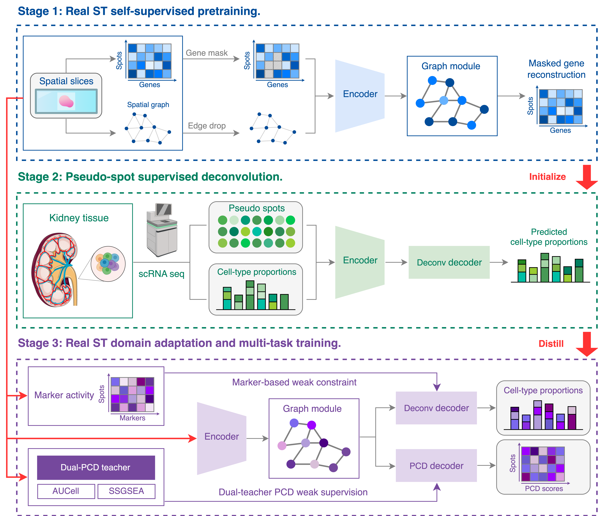

# CoDeST

CoDeST (Confidence-weighted Dual-teacher Spatial Training) is a multi-task spatial inference framework for KPMP kidney spatial transcriptomics (ST), designed to jointly infer spot-level cell composition (34 cell types) and programmed cell death (PCD) intensities (4 programs).

---

## Background and Task Objectives

Kidney ST data provide gene expression together with spatial coordinates, but each spot contains a mixture of cell types, requiring deconvolution to recover cell-type composition. PCD signals typically lack “hard labels” and are often approximated using noisy weak supervision from gene-set scoring methods such as AUCell and ssGSEA. CoDeST aims to train a spatial multi-task model on KPMP kidney ST slices to output:
1) **34-class cell-type proportions (Deconvolution)** for each spot  
2) **Continuous intensities for 4 PCD programs (Apoptosis / Pyroptosis / Necroptosis / Ferroptosis)** for each spot

---

## Architecture Figure

---

## Method / Model Overview

CoDeST follows a “three-stage training + unified model backbone” design:

- **Stage 1 (ST self-supervised pretraining):** Learn spatial expression representations on real ST slices (encoder + graph) to improve cross-donor generalization.  
- **Stage 2 (pseudo supervised deconvolution):** Train the deconvolution head with strong labels on pseudo-spots (graph module disabled: `h=z`), producing a deconvolution teacher.  
- **Stage 3 (joint training on real ST):** Enable the graph module and spatial regularization on real ST, jointly optimize deconvolution and PCD prediction, and realize the three key innovations (see below).

Model outputs:
- **Deconv head:** 34-way softmax (cell-type composition proportions)  
- **Death head:** 4-dimensional continuous regression (PCD intensities)

---

## Design Highlights

1) **Dual-teacher agreement + confidence weighting:** Weak supervision comes from two scoring methods, **AUCell** and **ssGSEA**. Their agreement is used to estimate sample-level confidence, down-weighting inconsistent samples to reduce the impact of noisy weak labels.  
2) **Edge-preserving spatial smoothing (edge-preserving regularization):** Spatial consistency is enforced with boundary-preserving penalties such as **Huber/Charbonnier**, achieving denoising without erasing tissue boundaries.  
3) **Self-training/distillation + spatial structure:** The Stage 2 deconvolution model acts as a teacher and provides soft targets on real ST; the student combines the spatial graph and spatial regularization to correct domain shift and improve generalization.

---

## Model pipeline

1) **Stage 1:** self-supervised pretraining (ST train slices)  
2) **Stage 2:** supervised deconvolution training on pseudo-spots (pseudo_train/val)  
3) **Stage 3:** joint training on real ST (distillation + dual-teacher confidence weighting + edge-preserving spatial regularization)

---

For questions about the data and code, please contact znciep@163.com.
